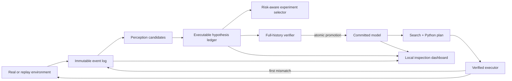

# ARCWorld

[GitHub repository](https://github.com/TidalTunes/arcworld)

ARCWorld is a local-first research suite for attacking interactive, hidden-rule grid
worlds with executable world models. It is being developed against the 25 ARC-AGI-3
Public Demo environments, while treating those exposed games as a development set rather
than evidence of generalization.

The central loop is deliberately simple:

```text
observe → parse objects → maintain competing rule programs → choose an informative move
       → certify one program on all evidence → plan in simulation → execute until surprise
```

The project starts from the requested `step(state, action)` architecture, but does not
present that loop as novel. Executable World Models, OPINE-World, and especially Schema
already implement close variants and report near-saturation on the public games. The
research bet here is narrower and testable: retain a version space of executable models
and competing object ontologies, then choose experiments by information gain adjusted
for action cost and irreversible risk.

## What is implemented

- Lossless observations and transitions with a SQLite event store.
- Multi-hypothesis object extraction, relationships, temporal identity tracking, and semantic
  plus exact-pixel diffs.
- A small executable model contract centered on `step(state, action)`.
- Isolated generated-code workers with JSON-only I/O, fresh globals, and resource limits.
- Content-addressed model revisions with complete-history replay gates.
- A shadow hypothesis ledger and disagreement-based probe ranking.
- Bounded simulator search, a Python plan DSL, and per-action verified execution.
- Optional OpenAI Responses API roles, isolated from benchmark metadata.
- An authenticated OpenAI Codex CLI transport for API-key-free development runs.
- An offline official-SDK adapter and a deterministic synthetic environment.
- A restrained local dashboard with Actual / Predicted / Diff views and a model timeline.
- A deep run audit linking provider receipts, generated source, sandbox execution,
  simulation, and official environment transitions.

The high-level composition lives in
[`src/arcworld/agent.py`](src/arcworld/agent.py). Mechanisms live in focused packages.
See the [`architecture tour`](docs/architecture-tour.md) for the module boundaries and
[`running experiments`](docs/running-experiments.md) for local, OpenAI-development, and
bundled-local-model workflows.

## Quick start

Python 3.12 or newer is required.

```bash
python3 -m venv .venv
source .venv/bin/activate
python -m pip install -U pip
python -m pip install -e '.[dev,gui,openai]'

arcworld doctor
arcworld toy-run
arcworld gui
```

The dashboard binds to `127.0.0.1:8765` and does not open a browser automatically.
Real public-game runs are labeled separately from synthetic fixtures and show their
event-chain and deep-audit status.

To work with locally downloaded public environments:

```bash
python -m pip install -e '.[arc]'
arcworld list-games --environments-dir environment_files
```

ARC environment files and generated recordings remain local and are gitignored.

## Architecture



Only the committed model controls planning. Replay-consistent alternatives remain
available as shadow models to expose ambiguity and select discriminating actions.

## Research record

The dated, source-linked research is kept in [`research/`](research/README.md):

- Benchmark rules, protocol, scoring, dates, data, and public-game inventory.
- Official and self-reported score regimes, with non-comparable results kept separate.
- Prior approaches and the precise overlap with the original project proposal.
- Architecture decisions, hypotheses, risks, and open experimental questions.
- A provenance log with repository commits and retrieval dates.

The snapshot is dated **2026-07-26**. Competition pages and leaderboards can change;
rerun the source audit before relying on a number.

## Evaluation discipline

Public-demo success is easy to overstate because public games have been inspected,
trained on, and rerun by the community. ARCWorld therefore:

- hides game IDs and benchmark lore from the game-playing model;
- reports pass@1 before rerun-selected results;
- keeps public, semi-private, Kaggle public-LB, and Kaggle private-LB scores distinct;
- supports blind synthetic worlds for regression and ablation;
- records prompt/configuration hashes and all failed transitions;
- never uses online ARC services during ordinary execution.

See [`research/evaluation_protocol.md`](research/evaluation_protocol.md) for the full
protocol.

## Verified real-game infrastructure run

On 2026-07-27, commit `39c6f88` executed an authenticated
`gpt-5.6-sol`/high-effort episode on the exact official
`vc33-5430563c` Public Demo environment in SDK OFFLINE mode. The model generated
and executed both world-model and plan Python, simulated the plan, spent one real
ACTION6 click, observed a counterexample, generated a revised model, and replayed
the complete one-transition history before promotion. All seven deep-audit checks
passed.

This was a one-action infrastructure-legitimacy test, not a solve or score claim.
The hash-anchored summary is in
[`evidence/vc33-live-llm-2026-07-27.json`](evidence/vc33-live-llm-2026-07-27.json).

## Status

This is a research scaffold, not a claimed competition solution. It provides the
instrumentation and falsifiable baseline needed to test whether explicit uncertainty
over rules and representations improves hidden-game transfer.
