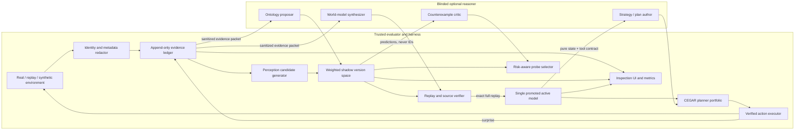

# ARCWorld research architecture

**Status:** target architecture and implementation contract
**Snapshot:** 2026-07-26
**Companion evidence:** [strategy landscape](landscape.md) and
[strategy source registry](sources-strategies.yaml)

## Research position

ARCWorld is a local-first harness for learning unfamiliar interactive grid
worlds from a single action history. It uses an executable
`step(state, action)` model, but that loop is a baseline rather than the novelty
claim: [Schema](https://schema-harness.github.io/),
[Executable World Models](https://arxiv.org/abs/2605.05138), and
[OPINE-World](https://arxiv.org/abs/2607.01531) already implement close
variants.

The testable research hypothesis is narrower:

> A single promoted controller backed by a weighted, replay-consistent shadow
> version space—where perception ontologies and latent state can also differ—
> will select safer, more informative actions and recover from wrong
> abstractions faster than a single editable simulator.

This remains a hypothesis until controlled blind experiments support it.

## Architectural invariants

These rules define the system more strongly than any module layout:

1. **One model controls actions.** Exactly one promoted active model may be used
   for exploitation planning at a time.
2. **Ambiguity is preserved.** Replay-consistent alternatives remain as shadow
   hypotheses instead of being overwritten.
3. **Promotion requires exact replay.** Semantic agreement can preserve a
   useful shadow model, but no model is promoted until it exactly reproduces
   every required known transition.
4. **Evidence is append-only.** Summaries, theories, and object graphs are
   derived indexes. They never replace pixels, metadata, actions, or outcomes.
5. **Every claim has provenance.** A rule, object identity, latent-state
   proposal, or macro links to the transitions that support and refute it.
6. **Real actions are scarce.** Simulator operations are unmetered; real
   actions are chosen for expected task progress or model discrimination.
7. **A plan is revocable.** Real execution checks each predicted successor and
   cancels the remaining plan at the first material surprise.
8. **The tested model is blind.** Game IDs, benchmark lore, human baselines,
   prior solutions, environment source, and internet access never enter its
   context.
9. **Generated code has narrow capabilities.** World models and plans receive
   data and pure helpers, never environment handles, files, subprocesses,
   sockets, secrets, or benchmark metadata.
10. **OpenAI is optional development infrastructure.** The core simulator,
    verifier, planners, replay tools, and GUI run without a network or API.

## System boundary

The trusted harness and the tested reasoner are different security domains.



The reasoner may be an OpenAI model during development or a local model in an
offline competition run. The trusted harness applies the same contracts either
way.

## Core data model

### Observation and transition

An observation contains all returned animation frames, available action IDs,
game status, and progress counters. Identity-bearing fields may be retained by
the trusted evaluator but are removed from reasoner-facing serialization.

One evidence event is:

```text
transition_id
episode_id
sequence_index
before_observation_hash
action
after_observation_hash
raw before/after frames and metadata
timestamp and environment call result
reasoner artifact hashes
```

The authoritative ledger is append-only and lossless. A reset, invalid action,
timeout, model error, and no-effect action are evidence and must not be dropped.
Database migrations may add indexes or derived tables but may not mutate a
recorded event.

### Perception hypothesis

A perception hypothesis is an executable mapping:

```python
parse(frame, history_features) -> SceneGraph
```

The scene graph contains:

- stable object or part identities;
- color, pixel mask, shape, holes, bounding box, centroid, orientation, and
  other derived attributes;
- relations such as touching, containing, inside, blocking, aligned, paired,
  same-shape, same-color, occluding, and relative offset;
- explicit confidence and the ontology program/hash that produced it.

Object extraction returns alternatives rather than silently selecting one.
Initial candidates include background-color alternatives, 4- versus
8-connectivity, single-color components, multicolor groups, repeated motifs,
part/whole decompositions, and merge/split interpretations. Temporal evidence
can raise or lower their weights.

### Executable world-model hypothesis

A model hypothesis is a content-addressed bundle:

```text
model digest
parent digest(s)
ontology digest
initial_state(observation) -> JSON state
step(state, action) -> JSON state
render(state) / render_frames(state) -> pixels
optional status(state), metrics(state), is_goal(state)
optional abstract(state) and latent-state fields
complexity score and log weight
supporting/refuting transition IDs
known domain and unresolved guards
verification reports
status: staged | semantic-shadow | exact-shadow | active | rejected
```

JSON-serializable state makes hashing, determinism checks, replay, search, and
GUI inspection straightforward. A model may contain object records and a small
latent automaton, but it may not inspect environment identity, wall-clock time,
files, network state, or global mutable state.

## Active model and shadow version space

ARCWorld deliberately combines a **single promoted active model** with several
**weighted shadows**:

- The active model is the only model allowed to generate an exploitation plan.
- Exact-shadow models have passed complete replay but are not promoted.
- Semantic-shadow models explain useful object/relation effects but fail exact
  pixels or secondary metadata. They may inform diagnosis and probe choice but
  may not authorize a long real plan.
- Rejected models remain content-addressed for provenance and regression
  analysis but receive no action-selection weight.

For replay-consistent candidates, a simple initial weighting is:

\[
p(h \mid D) \propto
\exp\left(\log p(D \mid h) - \lambda C(h)\right)
\]

where \(C(h)\) is a description-length proxy. Exact deterministic evidence
normally makes inconsistent models weight zero. Semantic shadows instead use
component likelihoods—for pixels, objects, relations, status, and progress—
whose calibration must be evaluated rather than assumed.

Promotion is an atomic transaction:

1. validate generated source and determinism;
2. replay the complete known history;
3. require the configured exact fields at every transition;
4. verify goal and progress functions against all observed level boundaries;
5. write the verification report;
6. update the active pointer;
7. retain the former active model as a shadow.

No LLM or UI action can bypass this gate.

## Competing ontologies

Rule revision and representation revision are separate operations. When a
counterexample arrives, the system classifies likely causes:

1. wrong object identity or temporal correspondence;
2. wrong part/whole granularity;
3. missing relation or affordance;
4. wrong transition guard or effect;
5. missing observable state feature;
6. missing latent state;
7. incorrect renderer or decorative residual;
8. stochasticity or environment nondeterminism;
9. invalid observation/action handling.

Ontology candidates form a lattice: a child may split an object, merge a
repeated pattern, add a role, or introduce a relation while preserving links to
its parent and the triggering evidence. World-model candidates point to a
specific ontology digest; a rule cannot silently reinterpret an object parser
without creating a new joint hypothesis.

The project should prefer causal roles learned from interventions—movable,
blocking, carried, switch, target, resource—over visual names inherited from
familiar games. Human-friendly labels are UI annotations, not input features.

## Latent-state discovery

The default model assumes deterministic observable dynamics. That assumption is
challenged whenever the ledger contains two transitions whose sanitized
observable state and action are equivalent but whose outcomes differ.

Before creating hidden state, the diagnostic pipeline tests:

1. missed animation frames or metadata;
2. object-tracking mismatch;
3. an omitted visible relation or counter;
4. action-coordinate or action-availability differences;
5. history-dependent but deterministic state;
6. true nondeterminism.

If visible refinements fail, the synthesizer may propose a small latent
automaton. Latent variables must:

- be updated only by observed actions and prior state;
- have a finite or explicitly bounded domain;
- improve replay consistency or predictive likelihood;
- pay a complexity penalty;
- expose an interpretable transition table in the GUI.

The first implementation should enumerate small finite states before attempting
arbitrary learned embeddings. Identical visible states may retain a belief over
latent states, turning planning into a small belief-state search problem.

## Tiered verification

Verification produces diagnostics at several tiers while preserving one hard
promotion rule.

| Tier | Checks | Permitted use |
|---|---|---|
| 0. Source and purity | AST/capability policy, JSON state, determinism, bounded execution | Reject unsafe or impure code |
| 1. Progress and control | action legality, terminal status, level counters, goal boundaries | Diagnose catastrophic semantic errors |
| 2. Relational semantics | object creation/removal/motion, attributes, relations, affordance effects | Retain and weight semantic shadows |
| 3. Final-frame exactness | exact settled pixels and required metadata | Required for active-model promotion |
| 4. Full response exactness | all animation frames and their order | Optional strict mode and renderer research |

Tier 2 exists so that a useful causal rule is not erased because of an
irrelevant animation or decorative pixel. It does not lower the Tier 3
promotion requirement. The GUI shows all tiers for every transition.

A mismatch record contains the active digest, action, predicted and actual
frames, semantic delta, first violated tier, queued actions cancelled, and the
resulting hypothesis updates.

## Risk-aware active probing

When no high-confidence active plan exists, the harness asks each viable shadow
model to predict candidate actions. Actions are grouped by outcome fingerprint.
A target objective is:

\[
U(a) =
\alpha\,I(H;O_{t+1}\mid a)
+ \beta\,\mathbb{E}[\text{task progress}]
+ \gamma\,\text{coverage novelty}
- \delta\,\text{real-action cost}
- \epsilon\,\Pr(\text{game over})
- \zeta\,\text{irreversibility}
- \eta\,\text{reset cost}.
\]

The selector records every term rather than returning an unexplained scalar.
Early versions may use weighted outcome entropy as the information term. Later
versions should compare expected posterior entropy and calibration.

Candidate generation includes:

- advertised primitive actions;
- salient click targets derived without game-specific rules;
- previously untested state-action pairs;
- short reversible action sequences;
- experiments proposed by the reasoner;
- actions on which high-weight hypotheses disagree.

A no-effect signature cache suppresses repeated probes in equivalent local
contexts. If every informative probe is too dangerous, the system may exploit
the active model, seek a reversible path to a safer test state, or stop rather
than fabricate certainty.

## Planning and CEGAR

Planning is a portfolio behind one interface:

```python
plan(model, state, goal, actions, budget) -> PlanResult
```

The initial portfolio should include:

- bounded breadth-first search for small exact state spaces;
- A* when an admissible or clearly labeled non-admissible heuristic exists;
- width-based or novelty search for sparse-reward exploration;
- constraint/backtracking search for ordering and placement problems;
- belief-state search for small latent-state hypotheses;
- reasoner-authored Python plans for structured loops and macros.

The router selects a planner from measurable properties—branching factor,
estimated state count, reversibility, available goal predicate, and constraint
structure—not from the public game ID.

Counterexample-guided abstraction refinement (CEGAR) prevents coarse search
from becoming a false proof:

1. project active state into a coarse relational abstraction;
2. search for an abstract plan;
3. replay it in the exact active model;
4. identify the first spurious transition;
5. add the missing predicate, object distinction, or latent factor;
6. repeat within a bounded refinement budget.

Every returned plan carries the active model digest, starting state hash,
planner/config hash, simulated outcome, preconditions, and confidence. It is
invalidated when any of these no longer match.

## Plan compilation and verified execution

The reasoner writes Python that constructs a sequence through a capability-poor
plan API. It never receives an environment object. Compilation validates the
source and simulates the entire sequence against the active model.

Real execution then follows model-predictive control:

1. predict one successor;
2. spend one real action;
3. append the actual transition before any further reasoning;
4. compute exact and semantic diffs;
5. stop on terminal state or material mismatch;
6. otherwise continue while plan preconditions remain valid.

Successful repeated sequences may be anti-unified into parameterized macros.
A macro stores preconditions, effects, supporting traces, model/ontology
digests, and per-step verification requirements. It is an optimization, never
an unverified action primitive.

## Memory and reasoner context

The memory design has two synchronized layers:

- **Evidence memory:** immutable pixels, actions, outcomes, metadata, errors,
  and artifact hashes.
- **Semantic memory:** scene graphs, tracks, theories, hypotheses, plans,
  summaries, and macros, each with provenance links.

Reasoner context is assembled by deterministic retrieval over the evidence
ledger and generated artifacts. A typical packet contains:

- current sanitized pixels and ASCII grid;
- advertised actions;
- recent exact transitions;
- relevant older transitions selected by object/action/diff signatures;
- active and shadow model interfaces and verification summaries;
- the explicit task requested from the reasoner.

It never contains game identity, benchmark descriptions, human action counts,
leaderboard results, public walkthroughs, or environment implementation.
Context eviction may remove copies from a prompt, but the ledger remains intact.

## Optional OpenAI integration

OpenAI is the sole permitted external model service during development. It is
an adapter, not a dependency of the architecture. Suggested optional roles are:

- ontology proposal from sanitized evidence;
- Python world-model revision;
- counterexample critique and discriminating-experiment proposal;
- high-level strategy or plan-code generation.

Every request records model ID, reasoning effort, request/prompt hash, sanitized
input artifact hashes, response hash, token usage, latency, and cost. Secrets
are read only by the adapter and never written to recordings or model
workspaces.

Offline and Kaggle profiles disable network adapters entirely and select a
bundled local reasoner or deterministic baseline. No hidden evaluation result
may depend on an undeclared external call.

## Module boundaries

The high-level `agent.py` should remain short and declarative. It wires
interfaces and owns the state machine; it should not implement perception,
verification, prompting, or search.

| Area | Responsibility | Current location / target |
|---|---|---|
| Domain types | Actions, observations, transitions, immutable grids | `src/arcworld/types.py` |
| Environments | Official offline adapter, replay, synthetic worlds | `src/arcworld/env/` |
| Evidence | Append-only episodes and persistent event store | `history.py`, `storage.py` |
| Perception | Candidate ontologies, objects, relations, tracking, diffs | `src/arcworld/perception/` |
| Generated models | Pure contract, revisions, replay verification | `src/arcworld/models/` |
| Version space | Hypotheses, evidence links, weights, promotion | `src/arcworld/hypotheses.py` |
| Probing | Candidate generation, information/risk scoring | `src/arcworld/probing.py` |
| Planning | Portfolio, CEGAR, plan DSL, verified executor | `src/arcworld/planning/` |
| Reasoners | Optional OpenAI/local adapters and sanitized context | `src/arcworld/llm/`; local adapter planned |
| Orchestration | Small phase/state-machine composition | `src/arcworld/agent.py`; phase integration partial |
| Inspection | Actual/predicted/diff, timelines, controls, exports | `src/arcworld/gui/`; advanced views planned |
| Evaluation | Manifests, runners, scoring, ablations, reports | `src/arcworld/evaluation/` planned |

Mechanisms depend on narrow protocols so that an independent researcher can
replace perception, weighting, planners, or reasoners without changing the
agent loop.

## Failure handling

Failures become structured artifacts:

- malformed or unsafe generated source is rejected before execution;
- generated-code timeouts or memory limits reject the revision;
- replay failure records the first and all subsequent counterexamples;
- environment/API errors are distinguished from legal no-effect actions;
- a real mismatch atomically stops the plan before theory revision;
- a reasoner outage falls back to deterministic exploration or stops cleanly;
- no active model means no simulated exploitation plan;
- repeated visible-state nondeterminism opens a latent-state diagnostic rather
  than silently lowering exactness.

The system should prefer a legible incomplete state over an opaque automatic
recovery that contaminates evidence.

## What would support the research hypothesis

Public Demo saturation is insufficient. The architecture earns support only if,
under the protocol in [evaluation_protocol.md](evaluation_protocol.md), the
version-space treatment improves at least one of the following on blind games:

- completion or official-style score at matched real-action budget;
- real actions at matched completion;
- calibration of predicted transitions or failure risk;
- time/actions required to recover after a counterexample;
- transfer to new games without game-specific state or prompt changes.

The single-active-model baseline, Schema-like exact replay loop, and minimal
lossless-memory agent must remain runnable so the additional mechanisms can be
falsified rather than assumed useful.
